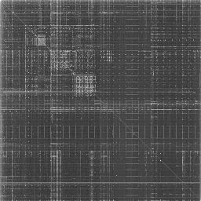

# Digraph Analysis - Binary Visualization

**Digraph Analysis** (You see as ***Markov Chain*** in some articles) is one of the way to visualize **Binary Files**. Images is always a good choice to look up for Patterns of differents kind of files extensions. The algorithm calculates the probability of a given byte ($B$) assuming a value between $0$ and $255$ within a given block of size $N$. Therefore, We divide the file size by $N$ blocks, calculate the **Frequency Distribution** of the bytes and calculate it entropy, using the formula:

$$H = \sum_{i=0}^{N-1}P(B=b_i)\log{\dfrac{1}{P(B=b_i)}} \rightarrow H = -\sum_{i=0}^{N-1}P(B=b_i)\log{P(B=b_i)}$$

#### It will give you an Array of Entropies! So, we can apply an scale in a Gray Color, for example, and create a BMP file with it!

